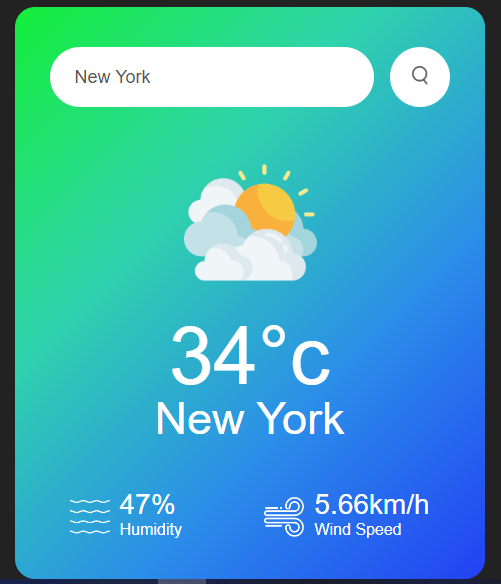
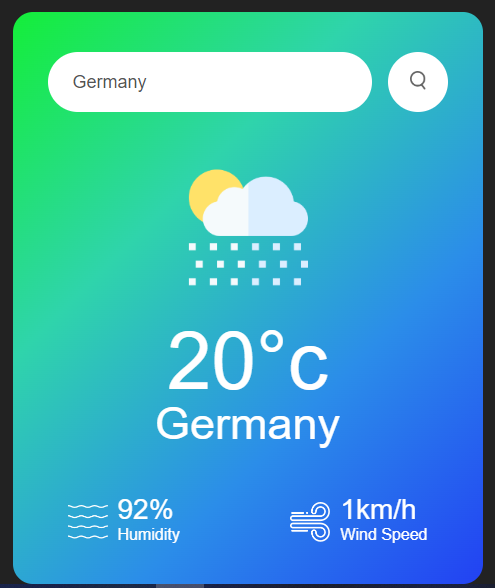
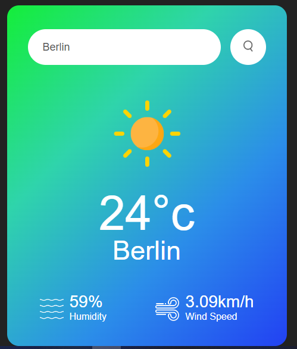

# Weather-App : Your Go-To Weather Companion
## Welcome to a simple weather app that allows users to search for the current weather conditions in a specific city.

## Features
* ### Weather app in action - Search for weather conditions by city name
 </img>
* ### Weather Details - Displays current temperature, humidity, and wind speed
 </img>
* ### Updates weather icon based on weather condition (cloudy, clear, rainy, drizzly, misty, snowy)
 </img>
 </img>
* ### Invalid City name - Error handling for invalid city names
 </img>

## Tech Stack
* ### HTML5
* ### CSS3 (using Poppins font and linear gradients)
* ### JavaScript (using async/await and fetch API)
* ### OpenWeatherMap API for weather data

## How to Use
1. ### Open the app in a web browser
2. ### Enter a city name in the search bar
3. ### Click the search button
4. ### The app will display the current weather conditions for the searched city

## License

This project is licensed under the MIT License. See `LICENSE` for details.

#### If you have any suggestions, ideas, or feedback, please don't hesitate to reach out ❤️
A huge thank you for taking the time to explore This weather app 😊.
